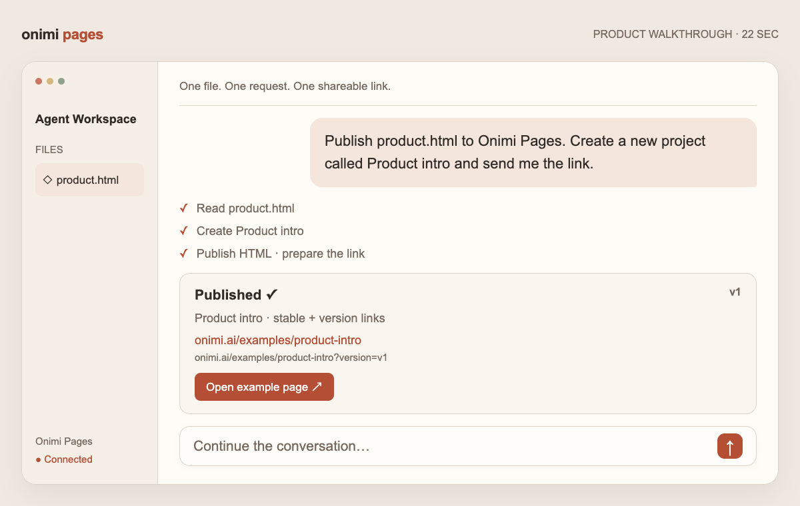

# Onimi Pages Publish

**English** | [简体中文](docs/zh-CN/README.md)

Publish an HTML page from your agent through browser-authorized Remote MCP.

## Install

Check the [verified channel states](https://downloads.onimi.ai/skills/manifest.json)
before choosing a registry source. Use npm's `latest` release only when the npm
channel is marked available; otherwise install through another channel marked available.

Copy this prompt into your agent:

> Read `skills.publish.archive.url`, `sha256`, and `size` from https://downloads.onimi.ai/skills/manifest.json. Download that exact Onimi Pages Publish archive and verify both its SHA-256 and byte size. Install the complete folder for only my current agent, preserving any existing installation. Follow the bundled connection guide to add `https://onimi.ai/mcp` and start browser OAuth. Let me sign in and approve access. Afterward, check the connection with `onimi_list_projects`. Do not create a project or publish anything yet.

Every source includes the complete skill. Installation and browser authorization
are separate steps. See the [installation guide](INSTALL.md) for client-specific commands.

Other installation sources:

- [npm](https://www.npmjs.com/package/onimi-pages-publish): `npx --registry=https://registry.npmjs.org onimi-pages-publish@latest --help`

- [Stable direct-download URL, version, size and SHA-256 manifest](https://downloads.onimi.ai/skills/manifest.json)
- [ClawHub: @mariohazy/onimi-pages-publish](https://clawhub.ai/mariohazy/onimi-pages-publish)
- GitHub: `npx --registry=https://registry.npmjs.org skills@1.5.26 add zlch-oceanai/onimi-pages-publish --skill onimi-pages-publish --global`

Service availability and client OAuth support depend on the hosted deployment and
client version. A published package does not establish production service acceptance.

## Watch the walkthrough

[Play or download the 22-second video](media/publish-demo-en.mp4) · [Interactive example](https://onimi.ai/how-to)

The video is an illustrative interface with sample content; it does not operate an account.

## Use

> Publish product.html to Onimi Pages. Create a new project called Product intro and send me the link.

Your agent reads the HTML, creates the requested project and publishes the page.
It returns a stable link and a version link (`?version=vN`). One project holds one page.
Manage sharing and revoke agent access in the [dashboard](https://onimi.ai/dashboard).
See the [help center](https://onimi.ai/help) for details.

## Repository layout

- `skills/onimi-pages-publish/`: skill, connection references and MCP dependency declaration.
- `bin/`: dependency-free npm installer; no automatic lifecycle scripts.
- `docs/zh-CN/`: Chinese README and installation guide.
- `media/`: English and Chinese videos and posters, excluded from npm and ClawHub packages.
- `dist/`: reproducible skill archives and checksums.

The repository contains public distribution files only. It excludes private application
code and credentials. The skill and installer use MIT-0, compatible with ClawHub's
publishing terms. Hosted service terms are separate.

## 0.2.1

- Stable manifest, immutable archives and a local-change-safe update manager.
- Separate English and Chinese installation guides; English remains the default.
- English and Chinese walkthrough videos and posters.

Review changes before updating. Direct-download installs can use
`node skills/onimi-pages-publish/scripts/manage.mjs status|check|update`; update requires explicit confirmation
and keeps a verified backup. npm, GitHub and ClawHub use their own update semantics.
