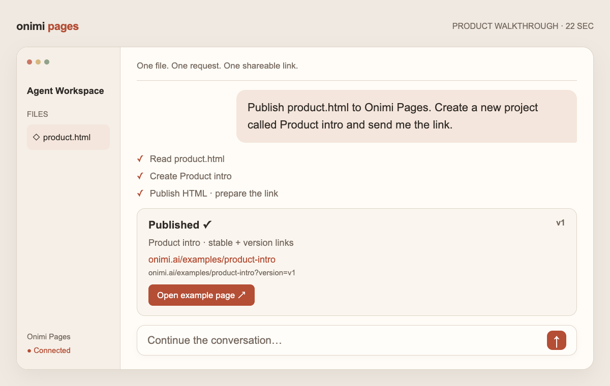

# Onimi · Creator + Publish

**English** | [简体中文](docs/zh-CN/README.md)

Create Pages and Slides in your agent, then save or publish them through browser-authorized Remote MCP.

## Install

Check the [verified channel states](https://downloads.onimi.ai/skills/manifest.json)
before choosing a registry source. Use npm's `latest` suite only when the Publish npm channel is
available and its channel version equals the current Publish version; otherwise use a current channel.

The default Onimi entry explicitly prepares both `onimi-pages-creator` and
`onimi-pages-publish`. Copy this prompt into your agent:

> Read the Creator and Publish entries from https://downloads.onimi.ai/skills/manifest.json. Inspect my current agent's real local Skill directory. Preserve existing folders and personal changes; download, verify and add only a missing module. Local creation needs no account. Before a cloud task, call `onimi_get_connection` and reuse a valid same-account connection when its scopes are sufficient. Otherwise explain the requested access and start browser OAuth so I can approve it. Never ask for a token. Do not create a project or publish anything yet.

The npm suite command is
`npx --registry=https://registry.npmjs.org onimi-pages-publish@latest install --suite --agent codex`.
Direct download resolves and verifies both immutable archives. Installation, connection and task
continuation are separate recoverable stages. See the [installation guide](INSTALL.md) for details.
Before a multi-step cloud write, Publish creates a private `0600` task journal with the fixed project,
draft/config/release references, mutation IDs and safe receipts. A new conversation resumes only the
incomplete step; it never stores source, prompts, OAuth material or one-time sharing secrets.

Publishing an existing HTML file without Creator remains an advanced compatible option: omit
`--suite` and install only Publish.

### Upgrade an existing Publish 0.2.1 folder

After the 0.3.1 Publish package is publicly available, use its installer against
the **parent** of the current `onimi-pages-publish` folder. Check that the
downloaded package itself is 0.3.1 before running these commands. They do not
contact Onimi, change the MCP connection, or install into WorkBuddy.

```sh
npx --registry=https://registry.npmjs.org onimi-pages-publish@0.3.1 legacy-plan --dir /absolute/path/to/skills
npx --registry=https://registry.npmjs.org onimi-pages-publish@0.3.1 legacy-upgrade --dir /absolute/path/to/skills --confirm onimi-pages-publish@0.3.1
```

The installer accepts only the exact public 0.2.1 receipt. An unmodified folder
switches to 0.3.1 and keeps the complete original outside the scanned skills
directory, under `../.onimi-pages-backups/skills/onimi-pages-publish.backup-legacy-0.2.1-*`
for the example path above. Running the command again does not create another backup.

If the plan lists local changes, the upgrade refuses to switch. Prepare a
separate candidate, then review every modified managed file against the new
version. Personal extra files are copied byte for byte into the candidate;
modified instructions are never automatically merged.

```sh
npx --registry=https://registry.npmjs.org onimi-pages-publish@0.3.1 legacy-prepare --dir /absolute/path/to/skills
# Review and merge files in ../.onimi-pages-migrations/skills/onimi-pages-publish.legacy-candidate-0.3.1.
npx --registry=https://registry.npmjs.org onimi-pages-publish@0.3.1 legacy-upgrade --dir /absolute/path/to/skills --confirm onimi-pages-publish@0.3.1 --reviewed-customizations
```

The old folder remains active until that final command succeeds. Activation
checks that reviewed modified files actually differ from the new baseline and
that extra personal files still match the original bytes. It keeps the entire
old folder as a backup. If the original changes after candidate preparation,
activation refuses; move the stale candidate aside and prepare a fresh one.
An unrecognized or missing receipt needs manual source review and is never
replaced by this command.
If a process crash leaves the active folder absent and its upgrade lock present,
run `npx --registry=https://registry.npmjs.org onimi-pages-publish@0.3.1 legacy-recover --dir /absolute/path/to/skills`.
It verifies the recorded original backup and restores it only when no active
folder exists. A reviewed candidate remains locally customized after activation;
future updates must also account for those edits.

Other installation sources:

- [npm](https://www.npmjs.com/package/onimi-pages-publish): `npx --registry=https://registry.npmjs.org onimi-pages-publish@latest --help`

- [Stable direct-download URL, version, size and SHA-256 manifest](https://downloads.onimi.ai/skills/manifest.json)
- [ClawHub: @mariohazy/onimi-pages-publish](https://clawhub.ai/mariohazy/onimi-pages-publish)
- GitHub: `npx --registry=https://registry.npmjs.org skills@1.5.26 add zlch-oceanai/onimi-pages-publish --skill onimi-pages-publish --global`

Service availability and client OAuth support depend on the hosted deployment and
client version. A published package does not establish production service acceptance.

## Watch the walkthrough

[](media/publish-demo-en.mp4)

[Play or download the 22-second video](media/publish-demo-en.mp4) · [Interactive example](https://onimi.ai/how-to)

The video is an illustrative interface with sample content; it does not operate an account.

## Use

> Publish product.html to Onimi Pages. Create a new project called Product intro and send me the link.

Your agent reads the HTML, creates the requested project and publishes the page.
It returns a stable link and a version link (`?version=vN`). One project holds one page.
Manage sharing and revoke agent access in the [dashboard](https://onimi.ai/dashboard).
See the [help center](https://onimi.ai/help) for details.

## Repository layout

- `skills/onimi-pages-publish/`: skill, connection references and MCP dependency declaration.
- `bin/`: dependency-free npm installer; no automatic lifecycle scripts.
- `docs/zh-CN/`: Chinese README and installation guide.
- `media/`: English and Chinese videos and posters, excluded from npm and ClawHub packages.
- `dist/`: reproducible skill archives and checksums.

The repository contains public distribution files only. It excludes private application
code and credentials. The skill and installer use MIT-0, compatible with ClawHub's
publishing terms. Hosted service terms are separate.

## 0.3.1

- One explicit Onimi suite command that preserves existing modules and adds only missing modules.
- Stable manifest, immutable archives and an offline `suite-status` that reports real local state.
- Private durable task receipts for safe retry and cross-conversation continuation.
- Separate English and Chinese installation guides; English remains the default.
- English and Chinese walkthrough videos and posters.

Review changes before updating. Direct-download installs can use
`node skills/onimi-pages-publish/scripts/manage.mjs status|check|update`; update requires explicit confirmation
and keeps a verified backup. npm, GitHub and ClawHub use their own update semantics.
