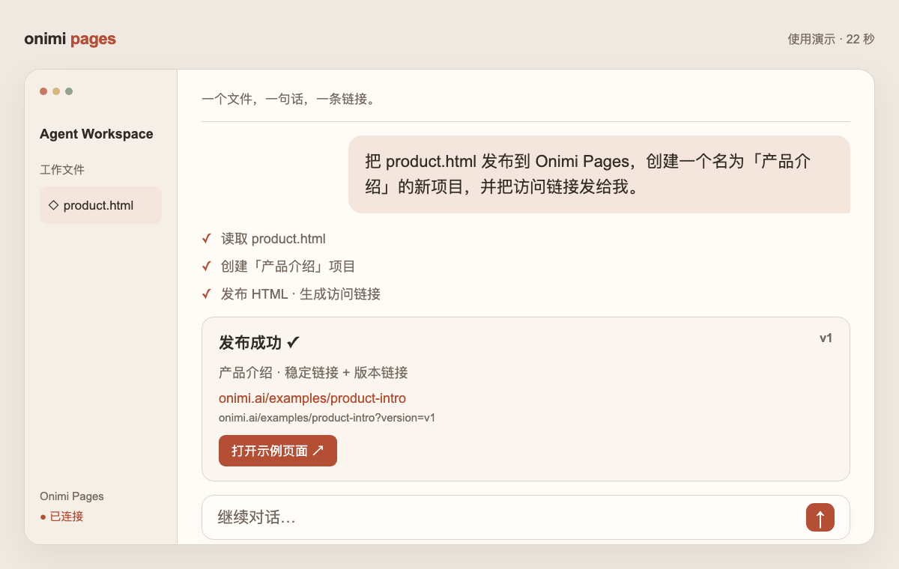

# Onimi Pages Publish

[English](../../README.md) | **简体中文**

在 Agent 对话中，通过浏览器授权发布 HTML 页面。

## 安装

选择市场渠道前，请先查看[已验证的渠道状态](https://downloads.onimi.ai/skills/manifest.json)。
npm 渠道标记为可用时再安装其 `latest` 版本；尚不可用时，请选择另一个已标记为可用的渠道。

把下面的提示词复制到当前 Agent：

> 请从 https://onimi.ai/skills/publish/latest 下载 Onimi Pages Publish Skill，并使用 https://downloads.onimi.ai/skills/manifest.json 中的 SHA-256 校验。将完整文件夹安装到当前 Agent 的个人技能目录，保留已有安装。阅读安装包内的中文连接指南，添加 `https://onimi.ai/mcp` 并发起浏览器 OAuth，让我完成登录和权限确认。授权后调用 `onimi_list_projects` 验证连接。本次只安装和连接，不创建项目或发布页面。

各来源均提供完整 Skill 文件。安装与浏览器授权是两个步骤，具体命令见[安装说明](INSTALL.md)。

也可以选择其他安装来源：

- [npm](https://www.npmjs.com/package/onimi-pages-publish)：`npx --registry=https://registry.npmjs.org onimi-pages-publish@latest --help`

- [稳定直接下载](https://onimi.ai/skills/publish/latest) · [版本与 SHA-256 清单](https://downloads.onimi.ai/skills/manifest.json)
- [ClawHub：@mariohazy/onimi-pages-publish](https://clawhub.ai/mariohazy/onimi-pages-publish)
- GitHub：`npx --registry=https://registry.npmjs.org skills@1.5.26 add zlch-oceanai/onimi-pages-publish --skill onimi-pages-publish --global`

服务可用性及 OAuth 支持取决于线上部署和客户端版本；安装包发布不代表生产服务已完成验收。

## 观看演示

[播放或下载 22 秒视频](../../media/publish-demo-zh-CN.mp4) · [在线使用演示](https://onimi.ai/how-to)

视频使用演示界面和示例内容，不会操作你的账号。

## 如何使用

> 把 product.html 发布到 Onimi Pages，创建一个名为「产品介绍」的新项目，并把访问链接发给我。

Agent 读取 HTML、创建你要求的新项目并发布页面，返回稳定链接和版本链接（`?version=vN`）。
一个项目对应一个页面。可以在[工作台](https://onimi.ai/dashboard)管理分享、撤销 Agent 授权。
详细操作见[帮助中心](https://onimi.ai/help)。

## 仓库目录

- `skills/onimi-pages-publish/`：Skill、连接说明及 MCP 依赖声明。
- `bin/`：无第三方依赖的 npm 安装器，没有自动安装脚本。
- `docs/zh-CN/`：中文 README 与安装说明，根目录默认英文。
- `media/`：中英文视频和封面，不进入 npm 或 ClawHub 安装包。
- `dist/`：可重复构建的 Skill ZIP 与校验值。

仓库仅包含公开分发文件，不包含私有应用代码或凭证。
Skill 和安装器使用 MIT-0 许可证，与 ClawHub 发布条款一致；托管服务适用独立条款。

## 0.2.0

- 稳定清单、不可变归档，以及保护本地修改的更新管理器。
- 中英文安装说明分开，默认英文。
- 提供中英文演示视频和封面。

更新前请阅读变更。直接下载安装可使用
`node scripts/manage.mjs status|check|update`；更新需要显式确认并保留校验过的备份。
npm、GitHub 与 ClawHub 分别使用各自的更新机制。
