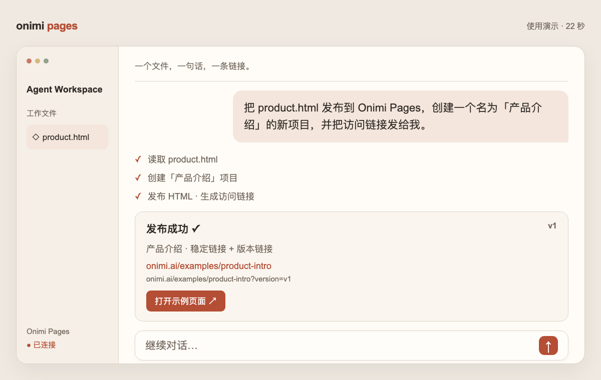

# Onimi · Creator + Publish

[English](../../README.md) | **简体中文**

在 Agent 中创作 Pages 与 Slides，再通过浏览器授权保存或发布。

## 安装

选择市场渠道前，请先查看[已验证的渠道状态](https://downloads.onimi.ai/skills/manifest.json)。
Publish npm 渠道可用且其渠道版本等于当前 Publish 版本时，才安装 `latest` 套件；否则选择版本已对齐的渠道。

默认 Onimi 入口会明确准备 `onimi-pages-creator` 与 `onimi-pages-publish` 两个模块。
把下面的提示词复制到当前 Agent：

> 请读取 https://downloads.onimi.ai/skills/manifest.json 中 Creator 与 Publish 的条目，检查当前 Agent 个人 Skill 目录的真实本地状态。保留已有目录和个人修改，只下载、校验并补齐缺失模块。本地创作不需要账号；云任务开始前先调用 `onimi_get_connection`，同账号连接的 scope 足够时直接复用，否则说明申请的访问范围并发起浏览器 OAuth 让我确认。不要索要 Token。本次不创建项目、不发布。

npm 套件命令为
`npx --registry=https://registry.npmjs.org onimi-pages-publish@latest install --suite --agent codex`。
直接下载会分别解析并校验两个不可变归档。安装、连接和原任务续接是三个可分别恢复的阶段，
具体说明见[安装说明](INSTALL.md)。只发布已有 HTML 的高级兼容方式仍可省略 `--suite`，仅安装 Publish。
多步云写入前，Publish 会在本机建立 `0600` 私有任务账本，固定项目、草稿／配置／发布引用、
mutation ID 和脱敏回执。新会话只恢复未完成步骤；源稿、提示词、OAuth 材料和一次性分享秘密不会落盘。

### 升级已有 Publish 0.2.1 目录

待 0.3.1 Publish 安装包公开且核对下载包版本后，对当前 `onimi-pages-publish`
目录的**父目录**执行以下命令。它们不连接 Onimi、不更改 MCP 连接，也不操作 WorkBuddy 安装。

```sh
npx --registry=https://registry.npmjs.org onimi-pages-publish@0.3.1 legacy-plan --dir /绝对路径/skills
npx --registry=https://registry.npmjs.org onimi-pages-publish@0.3.1 legacy-upgrade --dir /绝对路径/skills --confirm onimi-pages-publish@0.3.1
```

安装器只接受与公开 0.2.1 完全一致的安装回执。无定制目录升级后，完整旧目录保存在技能扫描目录之外；
以上述路径为例，位置是 `../.onimi-pages-backups/skills/onimi-pages-publish.backup-legacy-0.2.1-*`。
重复执行不会再建备份。

如检查发现本地改动，直接升级会拒绝切换。先生成独立的 0.3.1 候选目录，逐项审阅并合并
改过的受管理文件。新增的个人文件会逐字节复制到候选目录；修改过的指令不会自动合并。

```sh
npx --registry=https://registry.npmjs.org onimi-pages-publish@0.3.1 legacy-prepare --dir /绝对路径/skills
# 审阅并合并 ../.onimi-pages-migrations/skills/onimi-pages-publish.legacy-candidate-0.3.1 中的文件。
npx --registry=https://registry.npmjs.org onimi-pages-publish@0.3.1 legacy-upgrade --dir /绝对路径/skills --confirm onimi-pages-publish@0.3.1 --reviewed-customizations
```

最终切换成功前，旧目录始终保持活动。切换前会核对人工审阅的修改文件与新版基线确有差异，
个人新增文件与旧目录字节一致；切换后仍保留完整旧目录备份。准备候选后如旧目录又变化，
切换会拒绝，应把旧候选移走后重新准备。无法识别或缺少安装回执的目录必须人工核对来源，
此命令不会替换。
如果进程中断后活动目录缺失、升级锁仍在，可执行
`npx --registry=https://registry.npmjs.org onimi-pages-publish@0.3.1 legacy-recover --dir /绝对路径/skills`。它校验记录中的旧版备份，
仅在活动目录不存在时恢复。激活后的人工合并候选仍被视为本地定制，以后更新时也须处理这些修改。

也可以选择其他安装来源：

- [npm](https://www.npmjs.com/package/onimi-pages-publish)：`npx --registry=https://registry.npmjs.org onimi-pages-publish@latest --help`

- [稳定直接下载地址、版本、字节数与 SHA-256 清单](https://downloads.onimi.ai/skills/manifest.json)
- [ClawHub：@mariohazy/onimi-pages-publish](https://clawhub.ai/mariohazy/onimi-pages-publish)
- GitHub：`npx --registry=https://registry.npmjs.org skills@1.5.26 add zlch-oceanai/onimi-pages-publish --skill onimi-pages-publish --global`

服务可用性及 OAuth 支持取决于线上部署和客户端版本；安装包发布不代表生产服务已完成验收。

## 观看演示

[](../../media/publish-demo-zh-CN.mp4)

[播放或下载 22 秒视频](../../media/publish-demo-zh-CN.mp4) · [在线使用演示](https://onimi.ai/how-to)

视频使用演示界面和示例内容，不会操作你的账号。

## 如何使用

> 把 product.html 发布到 Onimi Pages，创建一个名为「产品介绍」的新项目，并把访问链接发给我。

Agent 读取 HTML、创建你要求的新项目并发布页面，返回稳定链接和版本链接（`?version=vN`）。
一个项目对应一个页面。可以在[工作台](https://onimi.ai/dashboard)管理分享、撤销 Agent 授权。
详细操作见[帮助中心](https://onimi.ai/help)。

## 仓库目录

- `skills/onimi-pages-publish/`：Skill、连接说明及 MCP 依赖声明。
- `bin/`：无第三方依赖的 npm 安装器，没有自动安装脚本。
- `docs/zh-CN/`：中文 README 与安装说明，根目录默认英文。
- `media/`：中英文视频和封面，不进入 npm 或 ClawHub 安装包。
- `dist/`：可重复构建的 Skill ZIP 与校验值。

仓库仅包含公开分发文件，不包含私有应用代码或凭证。
Skill 和安装器使用 MIT-0 许可证，与 ClawHub 发布条款一致；托管服务适用独立条款。

## 0.3.1

- 一个明确的 Onimi 套件命令，保留已有模块，只补缺失模块。
- 稳定清单、不可变归档，以及报告真实本地状态的离线 `suite-status`。
- 用于安全重试与跨会话续接的本机私有任务回执。
- 中英文安装说明分开，默认英文。
- 提供中英文演示视频和封面。

更新前请阅读变更。直接下载安装可使用
`node skills/onimi-pages-publish/scripts/manage.mjs status|check|update`；更新需要显式确认并保留校验过的备份。
npm、GitHub 与 ClawHub 分别使用各自的更新机制。
